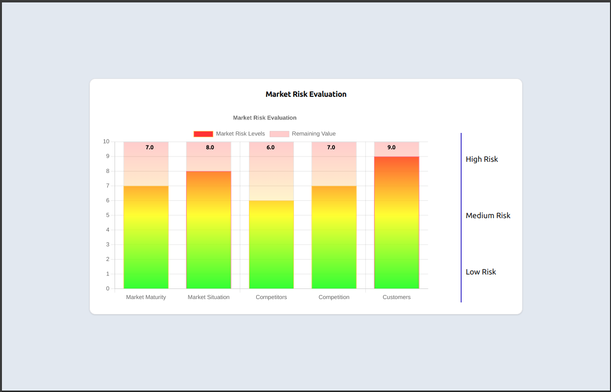

# Market Risk Evaluation Chart

This project is a **Market Risk Evaluation Chart** built using **React** and **Chart.js**. The chart visualizes market risk data with interactive bars that represent different risk levels.

## Table of Contents
- [Demo](#demo)
- [Features](#features)
- [Technologies Used](#technologies-used)
- [Components](#components)
- [Installation](#installation)
- [Usage](#usage)

## Demo
 

## Features
- Responsive design that adjusts to different screen sizes.
- Interactive bar chart with labels displaying data values.
- Clear visualization of risk levels categorized as Low, Medium, and High.

## Technologies Used
- **React**: For building the user interface.
- **Chart.js**: For rendering the bar chart.
- **Tailwind CSS**: For styling the components.
- **Typescript ES6**: For scripting.

## Components

### 1. **Charts Component**
Displays the bar chart using the Chart.js library. Renders dynamic data labels on top of the bars. Implements a responsive layout that adapts to screen sizes.

### 2. **RiskLevel Component**
Represents individual risk levels with colored boxes and labels. Used in the vertical legend to categorize risk levels.

## Installation
Clone the repository:
```bash
git clone https://github.com/Peliah/charts_V2.git

Navigate to the project directory:
```bash
cd charts_V2
```

Install dependencies:
```bash
npm install
```

## Usage
To run the project, use the following command:
```bash
npm run dev
```
This will start the development server and open the application in your default web browser.
